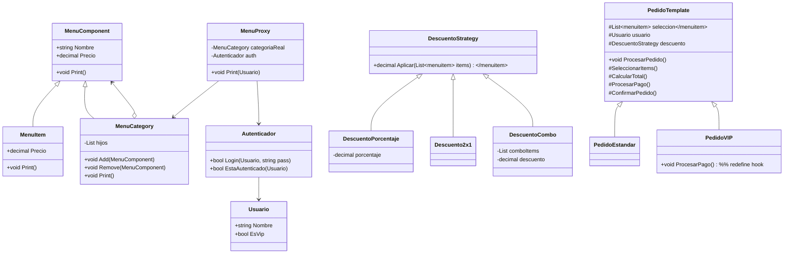

# Sistema de Restaurante con Patrones Estructurales

**Patrones aplicados:** Composite · Proxy · Strategy · Template Method
Lenguaje: C# (.NET)

Este proyecto implementa un **Sistema Dinámico de Menú para Restaurante**, aplicando de forma integrada los patrones de diseño **Composite**, **Proxy**, **Strategy** y **Template Method**, de acuerdo con la actividad académica propuesta.

El resultado es un sistema flexible, extensible y modular, capaz de construir menús anidados, aplicar descuentos dinámicos, controlar acceso a menús premium y ejecutar flujos de pedido personalizables.

---

## Como descargar el programa

Abre una consola en la ruta que quiera descargar el programa y ejecute
```bash
git clone https://github.com/Sebaxsus/RestaurantePatronesEstructurales.git
```

## Como ejecutar el Programa

```bash
cd RestaurantePatronesEstructurales
dotnet run
```

## Como compilar el programa

```bash
dotnet build
dotnet bin/Debug/net8.0/TuProyecto.dll
```

> [!NOTE]
>
> en la ruta `dotnet bin/Debug/net8.0/TuProyecto.dll` sustituya `/net.8.0/` con la version de .net instalada en su maquina.


> [!IMPORTANT]  
> 
> La version de **dotnet** debe ser mayor a `.net.7.0`.

---

## Características Principales

- **Menú Jerárquico (Composite)**:

    Permite crear menús estructurados en múltiples niveles:
**Categorías** → **Subcategorías** → **Ítems**
Cada `MenuCategory` puede contener elementos `MenuItem` o más categorías.
- **Control de acceso a menú Premium (Proxy)**:

    `MenuProxy` intercepta el acceso a ciertas secciones del menú y valida si el usuario está autenticado.
- **Descuentos dinámicos (Strategy)**:

    Descuentos intercambiables en tiempo de ejecución:
    - `DescuentoPorcentaje`
    - `Descuento2x1`
    - `DescuentoCombo`

    Se aplican a la selección de alimentos del usuario.
- **Flujo de pedido personalizable (Template Method)**:

    PedidoTemplate define los pasos base:

    1. Selección
    1. Cálculo de precio
    1. Aplicación de descuento
    1. Pago
    1. Confirmación

    Subclases modifican pasos específicos:

    PedidoEstandar:
    - PedidoVIP

---

## Estructura del proyecto

```
src/
├── Program.cs
├── README.md
│
├── menu/
│   ├── MenuComponent.cs
│   ├── MenuItem.cs
│   ├── MenuCategory.cs
│   └── MenuProxy.cs
│
├── descuento/
│   ├── DescuentoStrategy.cs
│   ├── DescuentoPorcentaje.cs
│   ├── Descuento2x1.cs
│   └── DescuentoCombo.cs
│
├── pedido/
│   ├── PedidoTemplate.cs
│   ├── PedidoEstandar.cs
│   └── PedidoVIP.cs
│
├── usuario/
│   ├── Usuario.cs
│   └── Autenticador.cs
```

## Diagramas UML



| Patrón | Clases | Propósito en el sistema | Ejemplo |
| ------ | ------ | ------ | ------ |
| **Composite** | `MenuComponent`, `MenuItem`, `MenuCategory` | Construir menús anidados con categorías e ítems. | Crear menús como “Bebidas → Gaseosas → Coca-Cola”. |
| **Proxy** | `MenuProxy` | Controlar acceso a secciones premium del menú. | Bloquear menú premium si el usuario no está autenticado. |
| **Strategy** | `DescuentoStrategy` y derivadas | Aplicar diferentes descuentos sin modificar la lógica del pedido. | Cambiar de 10% a combo o 2×1 en runtime. |
| **Template Method** | `PedidoTemplate`, `PedidoEstandar`, `PedidoVIP` | Estandarizar pasos del pedido con variaciones personalizadas.     | Flujo base con confirmación VIP personalizada. |
